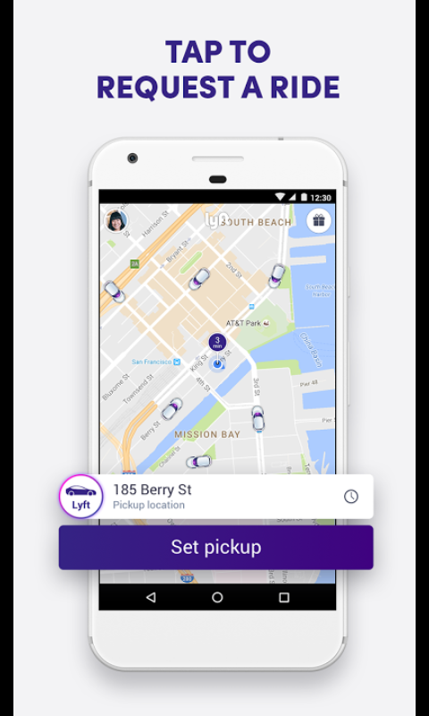
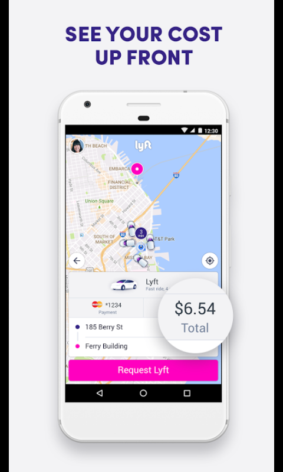
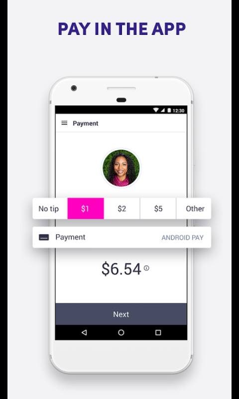
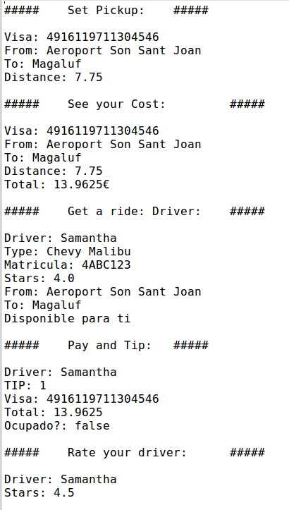

# Cotxox-Java
Este es un examen creado por [David Gelpi](https://github.com/dfleta), nuestro tutor y profesor de programación de DAW Dual.

El propósito de este proyecto era crear un programa parecido a Uber. 

[Repositorio del examen](https://github.com/dfleta/cotxox)

## Herramientas

Las herramientas proporcionadas por nuestro profesor fueron:

- Diagrama UML
- Historias de usuario
- Salida por consola
- Diagrama UML

## Porpósito

El propósito del examen es el mencionado anteriormente. Crear una aplicación parecida a Uber. 

También reforzar y practicar lo siguiente:

- TDD
- Streams
- SOLID
- Interfaces
- Listas
- Principios básicos de POO

## Diagrama UML

Diagrama UML proporcionado por David Gelpi

## Hisotrias de usuario

## Salida por consola

